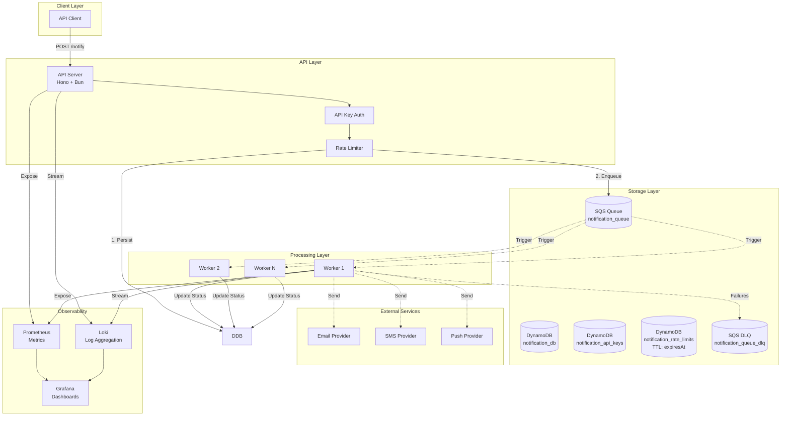
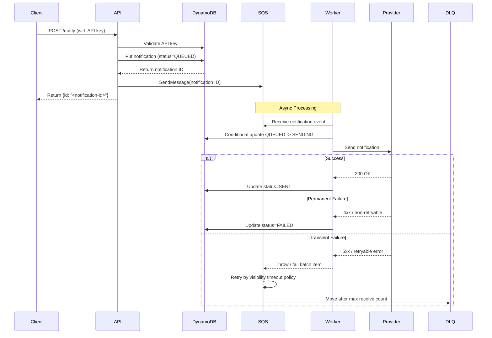

# Notification Service

A distributed, fault-tolerant notification processing system built with TypeScript, SQS, and DynamoDB. It is designed to handle high-throughput message delivery across multiple channels (email, SMS, push notifications) with durable state tracking, asynchronous processing, and comprehensive observability.

## Table of Contents

- [Overview](#overview)
- [Architecture](#architecture)
- [Technical Stack](#technical-stack)
- [Key Features](#key-features)
- [Getting Started](#getting-started)
- [API Reference](#api-reference)
- [Performance Metrics](#performance-metrics)
- [Monitoring](#monitoring)
- [Design Decisions](#design-decisions)
- [Project Structure](#project-structure)
- [Configuration](#configuration)
- [DynamoDB Indexes](#dynamodb-indexes)
- [Development](#development)
- [Deployment](#deployment)
- [Troubleshooting](#troubleshooting)

---

## Overview

This service implements a production-grade notification delivery system that processes messages asynchronously through SQS-backed workers. Notification state and API keys are persisted in DynamoDB, providing durable and scalable storage for status tracking and authentication workflows.

**Key Statistics (example baseline):**

- **Throughput:** 2,400 notifications processed in 126 seconds (19 req/s sustained)
- **Success Rate:** 98.2% delivery success rate
- **Latency:** P99 latency of 2.89 seconds under load
- **Reliability:** Zero failed virtual users during stress testing

---

## Architecture

### System Overview


```mermaid
graph TB
    subgraph "Client Layer"
        Client[API Client]
    end

    subgraph "API Layer"
        API[API Server<br/>Hono + Bun]
        Auth[API Key Auth]
        RateLimit[Rate Limiter]
    end

    subgraph "Storage Layer"
        DDB1[(DynamoDB<br/>notification_db)]
        DDB2[(DynamoDB<br/>notification_api_keys)]
        DDB3[(DynamoDB<br/>notification_rate_limits<br/>TTL: expiresAt)]
        SQS[(SQS Queue<br/>notification_queue)]
        DLQ[(SQS DLQ<br/>notification_queue_dlq)]

    end

    subgraph "Processing Layer"
        W1[Worker 1]
        W2[Worker 2]
        WN[Worker N]
    end

    subgraph "External Services"
        Email[Email Provider]
        SMS[SMS Provider]
        Push[Push Provider]
    end

    subgraph "Observability"
        Prom[Prometheus<br/>Metrics]
        Grafana[Grafana<br/>Dashboards]
        Loki[Loki<br/>Log Aggregation]
    end

    Client -->|POST /notify| API
    API --> Auth
    Auth --> RateLimit
    RateLimit -->|1. Persist| DDB
    RateLimit -->|2. Enqueue| SQS

    SQS -.->|Trigger| W1
    SQS -.->|Trigger| W2
    SQS -.->|Trigger| WN

    W1 -->|Update Status| DDB
    W2 -->|Update Status| DDB
    WN -->|Update Status| DDB

    W1 -.->|Send| Email
    W1 -.->|Send| SMS
    W1 -.->|Send| Push

    W1 -.->|Failures| DLQ

    API -->|Expose| Prom
    W1 -->|Expose| Prom
    Prom --> Grafana

    API -->|Stream| Loki
    W1 -->|Stream| Loki
    Loki --> Grafana
```

### Data Flow


```mermaid
sequenceDiagram
    participant C as Client
    participant A as API
    participant D as DynamoDB
    participant Q as SQS
    participant W as Worker
    participant P as Provider

    C->>A: POST /notify (with API key)
    A->>D: Validate API key
    A->>D: Put notification (status=QUEUED)
    D-->>A: Return notification ID
    A->>Q: SendMessage(notification ID)
    A-->>C: Return {id: "<notification-id>"}

    Note over Q,W: Async Processing

    W->>Q: Receive notification event
    W->>D: Conditional update QUEUED -> SENDING
    W->>P: Send notification

    alt Success
        P-->>W: 200 OK
        W->>D: Update status=SENT
    else Permanent Failure
        P-->>W: 4xx / non-retryable
        W->>D: Update status=FAILED
    else Transient Failure
        P-->>W: 5xx / retryable error
        W-->>Q: Throw / fail batch item
        Q->>Q: Retry by visibility timeout policy
        Q->>DLQ: Move after max receive count
    end
```

---

## Technical Stack

### Runtime & Frameworks

- **Bun** - Fast JavaScript runtime with built-in TypeScript support
- **Hono** - Lightweight, ultrafast web framework
- **TypeScript** - Type-safe development with strict configuration

### Data & Messaging

- **DynamoDB** - Durable, scalable NoSQL storage using three tables: `notification_db`, `notification_api_keys`, and `notification_rate_limits`
- **SQS** - Asynchronous message queue for notification dispatch
- **SQS DLQ** - Dead-letter handling for repeatedly failing jobs


### Observability

- **Prometheus** - Metrics collection and storage
- **Grafana** - Visualization and dashboards
- **Loki** - Log aggregation and querying
- **Pino** - High-performance structured logging

### Infrastructure

- **AWS CDK** - Infrastructure as code for Lambda, DynamoDB, and SQS
- **Docker & Docker Compose** - Containerization and orchestration

---

## Key Features

### 1. API Key Authentication

Service-to-service authentication using API keys with per-client rate limiting.

```bash
curl -X POST http://localhost:3000/notify \
  -H "Content-Type: application/json" \
  -H "x-api-key: YOUR_API_KEY" \
  -d '{
    "recipientId": "user123",
    "channel": "email",
    "channelAddress": "user@example.com",
    "payload": {"subject": "Welcome", "body": "Hello!"}
  }'
```

### 2. Durable Notification State

- Notification lifecycle tracked in DynamoDB:
  - `QUEUED` -> `SENDING` -> `SENT | FAILED`
- Conditional updates prevent duplicate processing races
- ID-based status lookup via `/status/:id`

### 3. Queue + DLQ Reliability

- Primary queue: `notification_queue`
- Dead-letter queue: `notification_queue_dlq`
- Failed messages are retried by SQS policy, then routed to DLQ for inspection

### 4. Comprehensive Monitoring

- Real-time metrics via `/metrics`
- Structured logs with context-rich fields
- Dashboard-ready metrics for API and worker health

---

## Getting Started

### Prerequisites

- **Bun** >= 1.0
- **Docker** and **Docker Compose**
- **AWS credentials** (for real AWS resources) or local AWS emulator setup

### Installation

1. **Clone the repository**

   ```bash
   git clone <repository-url>
   cd notification-service
   ```

2. **Install dependencies**

   ```bash
   bun install
   ```

3. **Configure environment variables**

   Create `config/.env` then set values listed in the [Configuration](#configuration) section.

4. **(Optional) Start local observability services**

   ```bash
   docker-compose -f compose.dev.yml up -d
   ```

5. **Create an API key**

   ```bash
   bun run scripts/api-key-gen.ts create "Development" 100
   ```

6. **Start services**

   ```bash
   bun run dev
   ```

### Quick Test

```bash
# Send notification
curl -X POST http://localhost:3000/notify \
  -H "Content-Type: application/json" \
  -H "x-api-key: <YOUR_API_KEY>" \
  -d '{
    "recipientId": "test-user",
    "channel": "email",
    "channelAddress": "test@example.com",
    "payload": {"message": "Hello World"}
  }'

# Check status (string ID)
curl http://localhost:3000/status/<NOTIFICATION_ID> \
  -H "x-api-key: <YOUR_API_KEY>"

# Metrics
curl http://localhost:3000/metrics
```

---

## API Reference

### Authentication

All business endpoints require API key authentication via `x-api-key`.

### Endpoints

#### POST /notify

Enqueue a notification for delivery.

**Request:**

```json
{
  "recipientId": "string",
  "channel": "email" | "sms" | "push",
  "channelAddress": "string",
  "payload": {}
}
```

**Response:**

```json
{
  "id": "a-string-notification-id"
}
```

**Status Codes:**

- `200` - Notification enqueued
- `401` - Missing/invalid API key
- `429` - Rate limited
- `400` - Invalid payload

---

#### GET /status/:id

Check notification status.

**Response:**

```json
{
  "id": "a-string-notification-id",
  "status": "QUEUED" | "SENDING" | "SENT" | "FAILED",
  "updatedAt": "2024-02-06T14:36:22.000Z"
}
```

**Status Codes:**

- `200` - Found
- `401` - Unauthorized
- `404` - Not found

---

#### GET /health

Health check endpoint.

**Status Codes:**

- `200` - Healthy
- `503` - Dependency unavailable

---

#### GET /metrics

Prometheus metrics endpoint.

---

## Performance Metrics

Example load profile remains applicable after migration:

- Sustained enqueue throughput with asynchronous worker processing
- P95/P99 latency driven by provider response and queue depth
- Failures isolated with retry + DLQ strategy

---

## Monitoring

### Key Metrics

#### API Metrics

- `api_jobs_enqueued_total`
- `api_jobs_enqueue_failed_total`

#### Worker Metrics

- `worker_jobs_picked_up_total`
- `worker_jobs_sent_total`
- `worker_jobs_failed_total`
- `worker_jobs_retried_total`

#### Queue / Storage Health

- Queue depth and DLQ counts (from SQS/CloudWatch)
- Notification status distribution (`QUEUED`, `SENDING`, `SENT`, `FAILED`)

---

## Design Decisions

### Why DynamoDB for Notification State?

**Decision:** Use DynamoDB for durable status state and API key records.

**Rationale:**

- **Scalability:** Handles high write/read throughput
- **Durability:** Managed persistence with multi-AZ reliability
- **Low operations overhead:** No server management
- **Access-pattern-driven model:** Efficient point lookups and conditional writes

### Why SQS + DLQ?

**Decision:** Use SQS for async dispatch and DLQ for poison message isolation.

**Rationale:**

- **Decouples API and worker throughput**
- **Built-in retry semantics**
- **DLQ provides operational safety and replay path**

### Why API Keys Over JWT?

Same rationale as before: simple service-to-service auth, revocation-friendly, and easy rate-limit association.

---

## Project Structure

```text
notification-service/
├── bin/                         # CDK app entrypoint
├── lib/                         # CDK stack definitions
├── packages/
│   ├── api/                     # REST API server
│   │   └── src/
│   ├── worker/                  # SQS/Lambda worker logic
│   │   └── lib/
│   └── shared/                  # Shared utilities
│       ├── lib/
│       │   ├── db.ts            # DynamoDB command-wrapper repositories
│       │   ├── queue/           # SQS queue wrapper
│       │   ├── logger.ts
│       │   ├── metrics.ts
│       │   └── rate-limiter.ts
│       └── env.ts
├── config/
├── scripts/
│   └── api-key-gen.ts
├── cdk.json
├── Dockerfile
└── README.md
```

---

## Configuration

### Environment Variables

```bash
# App
API_APP_PORT=3000
NODE_ENV=development

# App namespace
QUEUE_PREFIX=notification

# AWS
AWS_REGION=us-east-1
NOTIFICATION_QUEUE_URL=https://sqs.us-east-1.amazonaws.com/<account-id>/notification_queue

# DynamoDB
DYNAMODB_NOTIFICATION_TABLE_NAME=notification_db
DYNAMODB_API_KEY_TABLE_NAME=notification_api_keys
DYNAMODB_RATE_LIMIT_TABLE_NAME=notification_rate_limits
# Optional local emulator endpoint
DYNAMODB_ENDPOINT=http://localhost:8000

# Observability
LOKI_URL=http://localhost:3100
```

### API Key Management

```bash
# Create
bun run scripts/api-key-gen.ts create "Client Name" 100

# List
bun run scripts/api-key-gen.ts list

# Revoke
bun run scripts/api-key-gen.ts revoke <key_id>
```

---

## DynamoDB Tables and Indexes

The API key lookup path (`findByKey`) requires a GSI.

### Table 1: `notification_db`

- **Purpose:** Notification source of truth and status transitions (`QUEUED`, `SENDING`, `SENT`, `FAILED`)
- **Primary keys:** `pk` (partition), `sk` (sort)

### Table 2: `notification_api_keys`

- **Purpose:** API key storage and authentication lookup
- **Primary keys:** `pk` (partition), `sk` (sort)
- **Required GSI:**
  - **Index name:** `gsi1`
  - **Partition key:** `gsi1pk`
  - **Sort key:** `gsi1sk`

### Table 3: `notification_rate_limits`

- **Purpose:** Fixed-window rate-limit counters
- **Primary keys:** `pk` (partition), `sk` (sort)
- **TTL attribute:** `expiresAt` (epoch seconds)

### Why this GSI exists

API authentication receives raw API key text and needs fast lookup by that key.  
Without this index, lookup would require a table scan, which is expensive and slow at scale.

---

## Development

### Tests

```bash
bun test
```

### Type Check

```bash
bun run typecheck
```

### Build

```bash
bun run build
```

---

## Deployment

### CDK (recommended)

```bash
# synth
bunx cdk synth

# deploy
bunx cdk deploy
```

Expected resources include:

- Lambda worker (from `packages/worker/dist/index.mjs`)
- DynamoDB table: `notification_db`
- DynamoDB table: `notification_api_keys` (with GSI `gsi1`)
- DynamoDB table: `notification_rate_limits` (TTL on `expiresAt`)
- SQS queue: `notification_queue`
- SQS DLQ: `notification_queue_dlq`

### Docker

```bash
docker build -t notification-service:latest .
docker-compose up -d
```

---

## Troubleshooting

### Invalid or expired API key

- Ensure key exists and `isActive=true`
- Check `expiresAt`
- Confirm `gsi1` is present and populated (`gsi1pk/gsi1sk`)

### Messages not processing

- Verify worker subscription/trigger to `notification_queue`
- Inspect DLQ for repeatedly failing messages
- Confirm notification transitions from `QUEUED` to `SENDING`

### DynamoDB access errors

- Validate `AWS_REGION`, credentials, and table names
- If local emulator is used, verify `DYNAMODB_ENDPOINT`
- Confirm IAM policy allows `GetItem`, `PutItem`, `UpdateItem`, `Query`, `Scan`

---

## License

MIT
