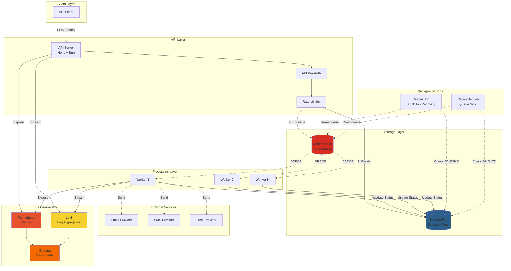
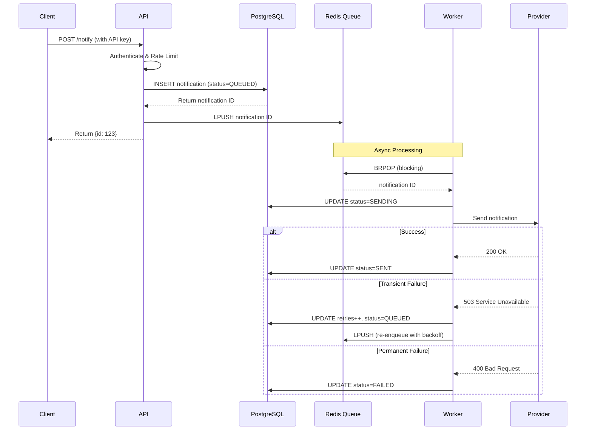
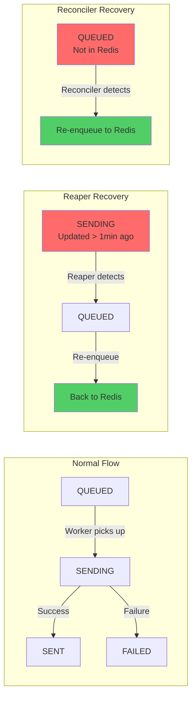

# Notification Service

A distributed, fault-tolerant notification processing system built with TypeScript, Redis, and PostgreSQL. Designed to handle high-throughput message delivery across multiple channels (email, SMS, push notifications) with guaranteed delivery and comprehensive observability.

## Table of Contents

- [Overview](#overview)
- [Architecture](#architecture)
- [Technical Stack](#technical-stack)
- [Key Features](#key-features)
- [Getting Started](#getting-started)
- [API Reference](#api-reference)
- [Performance Metrics](#performance-metrics)
- [Monitoring](#monitoring)
- [Design Decisions](#design-decisions)
- [Project Structure](#project-structure)
- [Configuration](#configuration)

---

## Overview

This service implements a production-grade notification delivery system that processes messages asynchronously through a Redis-backed queue. It provides guaranteed delivery through automatic retries, fault recovery mechanisms, and comprehensive monitoring.

**Key Statistics:**

- **Throughput:** 2,400 notifications processed in 126 seconds (19 req/s sustained)
- **Success Rate:** 98.2% delivery success rate
- **Latency:** P99 latency of 2.89 seconds under load
- **Reliability:** Zero failed virtual users during stress testing

---

## Architecture

### System Overview


```mermaid
graph TB
    subgraph "Client Layer"
        Client[API Client]
    end

    subgraph "API Layer"
        API[API Server<br/>Hono + Bun]
        Auth[API Key Auth]
        RateLimit[Rate Limiter]
    end

    subgraph "Storage Layer"
        DB[(PostgreSQL<br/>Source of Truth)]
        Redis[(Redis Queue<br/>Job Dispatch)]
    end

    subgraph "Processing Layer"
        W1[Worker 1]
        W2[Worker 2]
        WN[Worker N]
    end

    subgraph "External Services"
        Email[Email Provider]
        SMS[SMS Provider]
        Push[Push Provider]
    end

    subgraph "Background Jobs"
        Reaper[Reaper Job<br/>Stuck Job Recovery]
        Reconciler[Reconciler Job<br/>Queue Sync]
    end

    subgraph "Observability"
        Prom[Prometheus<br/>Metrics]
        Grafana[Grafana<br/>Dashboards]
        Loki[Loki<br/>Log Aggregation]
    end

    Client -->|POST /notify| API
    API --> Auth
    Auth --> RateLimit
    RateLimit -->|1. Persist| DB
    RateLimit -->|2. Enqueue| Redis

    Redis -.->|BRPOP| W1
    Redis -.->|BRPOP| W2
    Redis -.->|BRPOP| WN

    W1 -->|Update Status| DB
    W2 -->|Update Status| DB
    WN -->|Update Status| DB

    W1 -.->|Send| Email
    W1 -.->|Send| SMS
    W1 -.->|Send| Push

    Reaper -.->|Check SENDING| DB
    Reaper -.->|Re-enqueue| Redis

    Reconciler -.->|Check QUEUED| DB
    Reconciler -.->|Re-enqueue| Redis

    API -->|Expose| Prom
    W1 -->|Expose| Prom
    Prom --> Grafana

    API -->|Stream| Loki
    W1 -->|Stream| Loki
    Loki --> Grafana

    style DB fill:#2d5f8d
    style Redis fill:#d82c20
    style Prom fill:#e6522c
    style Grafana fill:#f46800
    style Loki fill:#f5d130
```

### Data Flow


```mermaid
sequenceDiagram
    participant C as Client
    participant A as API
    participant DB as PostgreSQL
    participant R as Redis Queue
    participant W as Worker
    participant P as Provider

    C->>A: POST /notify (with API key)
    A->>A: Authenticate & Rate Limit
    A->>DB: INSERT notification (status=QUEUED)
    DB-->>A: Return notification ID
    A->>R: LPUSH notification ID
    A-->>C: Return {id: 123}

    Note over R,W: Async Processing

    W->>R: BRPOP (blocking)
    R-->>W: notification ID
    W->>DB: UPDATE status=SENDING
    W->>P: Send notification

    alt Success
        P-->>W: 200 OK
        W->>DB: UPDATE status=SENT
    else Transient Failure
        P-->>W: 503 Service Unavailable
        W->>DB: UPDATE retries++, status=QUEUED
        W->>R: LPUSH (re-enqueue with backoff)
    else Permanent Failure
        P-->>W: 400 Bad Request
        W->>DB: UPDATE status=FAILED
    end
```

### Fault Recovery Mechanisms


```mermaid
graph LR
    subgraph "Normal Flow"
        Q1[QUEUED] -->|Worker picks up| S1[SENDING]
        S1 -->|Success| SE1[SENT]
        S1 -->|Failure| F1[FAILED]
    end

    subgraph "Reaper Recovery"
        S2[SENDING<br/>Updated > 1min ago] -->|Reaper detects| Q2[QUEUED]
        Q2 -->|Re-enqueue| R2[Back to Redis]
    end

    subgraph "Reconciler Recovery"
        Q3[QUEUED<br/>Not in Redis] -->|Reconciler detects| R3[Re-enqueue to Redis]
    end

    style S2 fill:#ff6b6b
    style Q3 fill:#ff6b6b
    style R2 fill:#51cf66
    style R3 fill:#51cf66
```

---

## Technical Stack

### Runtime & Frameworks

- **Bun** - Fast JavaScript runtime with built-in TypeScript support
- **Hono** - Lightweight, ultrafast web framework
- **TypeScript** - Type-safe development with strict configuration

### Data Storage

- **PostgreSQL 17** - Primary data store with full ACID guarantees
- **Redis 8** - In-memory queue for job distribution
- **Prisma** - Type-safe ORM with migrations support

### Observability

- **Prometheus** - Metrics collection and storage
- **Grafana** - Visualization and dashboards
- **Loki** - Log aggregation and querying
- **Pino** - High-performance structured logging

### Infrastructure

- **Docker & Docker Compose** - Containerization and orchestration
- **GitHub Actions** - CI/CD pipelines (planned)

---

## Key Features

### 1. API Key Authentication

Service-to-service authentication using API keys with per-client rate limiting.

```bash
curl -X POST http://localhost:3000/notify \
  -H "Content-Type: application/json" \
  -H "x-api-key: YOUR_API_KEY" \
  -d '{
    "recipientId": "user123",
    "channel": "email",
    "channelAddress": "user@example.com",
    "payload": {"subject": "Welcome", "body": "Hello!"}
  }'
```

### 2. Guaranteed Delivery

- **Automatic Retries:** Failed notifications retry up to 3 times with exponential backoff
- **Reaper Job:** Recovers notifications stuck in SENDING state (runs every minute)
- **Reconciler Job:** Re-enqueues notifications that are QUEUED but missing from Redis

### 3. Rate Limiting

- Per-API-key rate limiting (default: 100 requests/minute)
- Per-channel rate limiting (email/sms/push: 100 req/s each)
- Rate-limited requests are automatically re-queued with delay

### 4. Comprehensive Monitoring

- Real-time metrics exposed via `/metrics` endpoint
- Pre-built Grafana dashboards for system health
- Structured logging with correlation IDs
- Alert-ready metric definitions

---

## Getting Started

### Prerequisites

- **Bun** >= 1.0 ([Installation guide](https://bun.sh))
- **Docker** and **Docker Compose**

### Installation

1. **Clone the repository**

   ```bash
   git clone <repository-url>
   cd notification-service
   ```

2. **Install dependencies**

   ```bash
   bun install
   ```

3. **Start infrastructure services**

   ```bash
   docker-compose -f compose.dev.yml up -d
   ```

   This starts:
   - PostgreSQL on port 5432
   - Redis on port 6379
   - Prometheus on port 9090
   - Grafana on port 3001
   - Loki on port 3100

4. **Run database migrations**

   ```bash
   bun run migrate:dev
   ```

5. **Create an API key**

   ```bash
   bun run scripts/manage-api-keys.ts create "Development" 100
   ```

   Copy the generated API key for testing.

6. **Start the application**

   ```bash
   bun run dev
   ```

   The API will be available at `http://localhost:3000`

### Quick Test

```bash
# Send a test notification
curl -X POST http://localhost:3000/notify \
  -H "Content-Type: application/json" \
  -H "x-api-key: <YOUR_API_KEY>" \
  -d '{
    "recipientId": "test-user",
    "channel": "email",
    "channelAddress": "test@example.com",
    "payload": {"message": "Hello World"}
  }'

# Check notification status
curl http://localhost:3000/status/1 \
  -H "x-api-key: <YOUR_API_KEY>"

# View metrics
curl http://localhost:3000/metrics
```

### Accessing Monitoring Tools

- **Grafana:** http://localhost:3001 (admin / admin)
  - Navigate to Dashboards > Notification Service
- **Prometheus:** http://localhost:9090
  - Query metrics directly or check targets

---

## API Reference

### Authentication

All endpoints except `/health` and `/metrics` require API key authentication via the `x-api-key` header.

### Endpoints

#### POST /notify

Enqueue a notification for delivery.

**Request:**

```json
{
  "recipientId": "string",
  "channel": "email" | "sms" | "push",
  "channelAddress": "string",
  "payload": {
    // Channel-specific data
  }
}
```

**Response:**

```json
{
  "id": 123
}
```

**Status Codes:**

- `200` - Notification enqueued successfully
- `401` - Missing or invalid API key
- `429` - Rate limit exceeded
- `400` - Invalid request body

---

#### GET /status/:id

Check the status of a notification.

**Response:**

```json
{
  "id": 123,
  "status": "QUEUED" | "SENDING" | "SENT" | "FAILED",
  "updatedAt": "2024-02-06T14:36:22.000Z"
}
```

**Status Codes:**

- `200` - Status retrieved
- `401` - Missing or invalid API key
- `404` - Notification not found

---

#### GET /health

Health check endpoint (no authentication required).

**Response:**

```json
{
  "status": "healthy"
}
```

**Status Codes:**

- `200` - All systems operational
- `503` - Database or Redis unavailable

---

#### GET /metrics

Prometheus metrics endpoint (no authentication required).

**Response:** Prometheus text format

---

## Performance Metrics

### Load Test Results

Tested with Artillery at 20 requests/second for 120 seconds:

```
Total Scenarios: 2,400
Success Rate: 100% (0 failed virtual users)
Response Times:
  - Min: 10.7ms
  - Median: 19.1ms
  - P95: 854.2ms
  - P99: 2,893.5ms
  - Max: 4,318.1ms
Mean: 134.1ms
```

### Production Metrics (from Grafana)

- **Total Jobs Enqueued:** 2.37K
- **Successfully Sent:** 1.53K (98.2% success rate)
- **Permanently Failed:** 28 (1.8%)
- **Retry Ratio:** 0.926 retries per successful job
- **Database Queue State:** 0 queued (all processed)

### System Behavior Under Load

1. **Enqueue Rate:** Consistent 20 req/s as configured
2. **Processing Rate:** Matches enqueue rate with minimal lag
3. **Queue Depth:** Remains at 0-8 during sustained load
4. **Success Rate:** Maintains >98% across all test duration
5. **Fault Recovery:** Reaper and Reconciler jobs operate correctly

---

## Monitoring

### Key Metrics

#### API Metrics

- `api_jobs_enqueued_total` - Total notifications enqueued
- `api_jobs_enqueue_failed_total` - Enqueue failures

#### Worker Metrics

- `worker_jobs_picked_up_total` - Jobs dequeued by workers
- `worker_jobs_sent_total` - Successfully delivered notifications
- `worker_jobs_failed_total` - Permanently failed notifications
- `worker_jobs_retried_total` - Retry attempts

#### Background Job Metrics

- `reaper_runs_total` - Reaper job executions
- `reaper_stuck_jobs_detected_total` - Stuck jobs found
- `reaper_stuck_jobs_requeued_total` - Stuck jobs recovered
- `reconciler_runs_total` - Reconciler job executions
- `reconciler_jobs_detected_total` - Missing jobs found
- `reconciler_jobs_requeued_total` - Missing jobs recovered

#### Database Metrics

- `db_queued_notifications` - Notifications in QUEUED state
- `db_sending_notifications` - Notifications in SENDING state

### Grafana Dashboard

The pre-configured dashboard includes:

1. **High-Level Overview**
   - Total jobs enqueued
   - Successfully sent count
   - Permanently failed count
   - Overall success rate

2. **Throughput Analysis**
   - Enqueue rate (req/s)
   - Processing rate (req/s)
   - Success/failure rates over time

3. **Queue Health**
   - Database queue state
   - Job status distribution
   - Retry ratio trends

4. **Fault Recovery**
   - Reaper detection and recovery
   - Reconciler detection and recovery
   - Background job run counts

---

## Design Decisions

### Why Queue-Based Architecture?

**Decision:** Use Redis queue for job distribution instead of polling the database.

**Rationale:**

- **Performance:** Redis BRPOP is O(1) vs database polling overhead
- **Scalability:** Workers can scale independently without database load
- **Simplicity:** Redis handles blocking and FIFO ordering natively
- **Real-time:** Immediate job dispatch vs polling intervals

**Trade-off:** Requires Redis as additional dependency and introduces queue/database sync challenges (addressed by Reconciler).

---

### Why Separate Reaper and Reconciler Jobs?

**Decision:** Implement two distinct background recovery mechanisms.

**Rationale:**

- **Reaper:** Handles workers that crash mid-processing (SENDING state)
  - Problem: Worker picks up job, updates DB to SENDING, then crashes
  - Solution: If SENDING for >1 minute, reset to QUEUED and re-enqueue
- **Reconciler:** Handles jobs missing from Redis queue
  - Problem: Job is QUEUED in DB but not in Redis (Redis restart, etc.)
  - Solution: Query QUEUED jobs not updated recently, re-enqueue to Redis

**Trade-off:** Additional complexity, but critical for fault tolerance. Without these, jobs could be permanently lost.

---

### Why Exponential Backoff for Retries?

**Decision:** Use exponential backoff (2^retry \* 500ms) instead of fixed delays.

**Rationale:**

- **Prevents thundering herd:** Spreads out retry attempts
- **Adapts to provider recovery:** Gives external services time to recover
- **Reduces load:** Fewer retry spikes compared to fixed intervals

**Implementation:**

```typescript
delay = baseDelay * Math.pow(exponentialFactor, retryCount);
// retry 0: 500ms
// retry 1: 1000ms
// retry 2: 2000ms
```

---

### Why PostgreSQL as Source of Truth?

**Decision:** Use PostgreSQL instead of Redis or a message queue like RabbitMQ.

**Rationale:**

- **Durability:** PostgreSQL provides ACID guarantees and persistence
- **Audit trail:** Complete history of notification states
- **Querying:** Complex queries for analytics and debugging
- **Consistency:** Single source of truth for notification status

**Trade-off:** Additional latency vs pure in-memory queue, but acceptable for notification use case where delivery guarantees matter more than sub-millisecond latency.

---

### Why API Keys Over JWT?

**Decision:** Use API keys for authentication instead of JWT tokens.

**Rationale:**

- **Simplicity:** No token refresh logic needed
- **Service-to-service:** This is a B2B API, not user-facing
- **Revocation:** Instant key disabling without token blacklists
- **Rate limiting:** Easy to associate limits with API key
- **Industry standard:** Stripe, Twilio, SendGrid all use API keys

**Trade-off:** Requires database lookup on each request (mitigated by fast DB queries and potential caching).

---

### Why Bun Over Node.js?

**Decision:** Use Bun runtime instead of Node.js.

**Rationale:**

- **Performance:** 3x faster startup, faster execution
- **Built-in TypeScript:** No compilation step needed
- **Better DX:** Fast package manager, simpler tooling
- **Modern APIs:** Native support for modern JavaScript features

**Trade-off:** Smaller ecosystem and community compared to Node.js, but acceptable for greenfield projects.

---

## Project Structure

```
notification-service/
├── packages/
│   ├── api/                    # REST API server
│   │   ├── src/
│   │   │   ├── app.ts         # Hono app definition
│   │   │   ├── index.ts       # Server entry point
│   │   │   ├── middleware/    # Auth, rate limiting
│   │   │   ├── jobs/          # Reaper, Reconciler
│   │   │   └── lib/           # Schemas, utilities
│   │   └── package.json
│   │
│   ├── worker/                 # Background job processor
│   │   ├── index.ts           # Worker entry point
│   │   ├── lib/
│   │   │   ├── notification-handler.ts  # Core processing logic
│   │   │   ├── metrics.ts     # Worker-specific metrics
│   │   │   └── providers/     # Email, SMS, Push providers
│   │   └── package.json
│   │
│   └── shared/                 # Shared utilities
│       ├── lib/
│       │   ├── db.ts          # Prisma client factory
│       │   ├── logger.ts      # Pino logger setup
│       │   ├── metrics.ts     # Prometheus metrics
│       │   ├── queue.ts       # Redis queue wrapper
│       │   └── rate-limiter.ts # Rate limiting logic
│       ├── env.ts             # Environment validation
│       └── package.json
│
├── prisma/
│   ├── schema.prisma          # Database schema
│   └── migrations/            # Migration history
│
├── config/
│   ├── grafana/
│   │   ├── dashboards/        # Dashboard provisioning
│   │   ├── datasources/       # Prometheus + Loki config
│   │   └── dashboard-definitions/  # JSON dashboards
│   ├── prometheus/
│   │   ├── prometheus.yml     # Scrape configuration
│   │   └── prometheus.dev.yml # Development config
│   ├── api.env.example        # API environment variables
│   ├── db.env.example         # Database credentials
│   └── grafana.env.example    # Grafana admin credentials
│
├── scripts/
│   └── manage-api-keys.ts     # API key management CLI
│
├── compose.dev.yml            # Development infrastructure
├── compose.yml                # Production-ready setup
├── Dockerfile                 # Multi-stage build
├── stress-test.yml            # Artillery load test config
└── README.md
```

---

## Configuration

### Environment Variables

#### Application Config (config/api.env.example)

```bash
# Server
APP_PORT=3000                         # API server port
NODE_ENV=development                  # Environment (development|production)

# Database
POSTGRES_HOST=localhost               # PostgreSQL host
POSTGRES_USER=notification_user       # Database user
POSTGRES_PASSWORD=notification_pass   # Database password
POSTGRES_DB=notification_db           # Database name

# Redis
REDIS_URL=localhost:6379              # Redis connection string

# Observability
LOKI_URL=http://localhost:3100        # Loki endpoint for logs

# Queue
QUEUE_PREFIX=redis_mq                 # Redis key prefix
NUM_THREADS=2                         # Number of worker threads

# Retry Logic
MAX_RETRIES=3                         # Max retry attempts per notification
BACKOFF_EXPONENTIAL_FACTOR=2          # Backoff multiplier (2^retry)
BACKOFF_BASE_DELAY_MS=500             # Base retry delay in milliseconds

# Rate Limiting
RATE_LIMIT_REQUEUE_DELAY_MS=1000      # Delay before re-enqueuing rate-limited jobs

# Background Jobs
REAPING_INTERVAL_MINS=1               # How often to run Reaper
RECONCILIATION_INTERVAL_MINS=1        # How often to run Reconciler
```

#### Database Config (config/db.env.example)

```bash
POSTGRES_USER=notification_user
POSTGRES_PASSWORD=notification_password
POSTGRES_DB=notification_db
```

### API Key Management

```bash
# Create a new API key
bun run scripts/manage-api-keys.ts create "Client Name" 100

# List all API keys
bun run scripts/manage-api-keys.ts list

# Revoke an API key
bun run scripts/manage-api-keys.ts revoke <key_id>
```

---

## Development

### Running Tests

```bash
bun test
```

### Running Load Tests

```bash
bun run stressTest
```

### Database Migrations

```bash
# Create a new migration
bun run migrate:dev

# Deploy migrations (production)
bun run migrate:deploy
```

### Type Checking

```bash
bun run typecheck
```

### Building for Production

```bash
# Build all packages
bun run build

# Build Docker image
docker build -t notification-service:latest .
```

---

## Deployment

### Docker Compose (Recommended for Initial Production)

1. **Build the image:**

   ```bash
   docker build -t notification-service:latest .
   ```

2. **Start services:**

   ```bash
   docker-compose up -d
   ```

3. **Run migrations:**

   ```bash
   docker-compose run --rm migrations
   ```

### Production Checklist

- [ ] Change all default passwords in `config/*.env.example`
- [ ] Use Docker secrets or external secret management
- [ ] Configure proper log retention in Loki
- [ ] Set up alerting rules in Prometheus
- [ ] Configure backup strategy for PostgreSQL
- [ ] Set up Redis persistence (AOF or RDB)
- [ ] Configure proper resource limits in compose file
- [ ] Set up reverse proxy (nginx/Traefik) with TLS
- [ ] Configure rate limits based on expected load
- [ ] Test disaster recovery procedures

---

## Troubleshooting

### Workers not processing jobs

**Check:**

1. Workers are running: `docker-compose ps worker`
2. Redis is accessible: `docker-compose exec worker bun run -e "import Redis from 'ioredis'; const r = new Redis('redis:6379'); await r.ping();"`
3. Check worker logs: `docker-compose logs -f worker`

### High retry rate

**Possible causes:**

- External provider issues (check provider status pages)
- Rate limiting too aggressive (check metrics for rate limit errors)
- Network connectivity issues

**Mitigation:**

- Adjust `BACKOFF_BASE_DELAY_MS` and `BACKOFF_EXPONENTIAL_FACTOR`
- Increase provider rate limits if possible
- Check worker resource constraints

### Database connection errors

**Check:**

1. Database is healthy: `docker-compose ps db`
2. Connection pool settings in `shared/lib/db.ts`
3. Number of connections: `SELECT count(*) FROM pg_stat_activity;`

**Solution:**

- Increase connection pool size if needed
- Scale workers vertically instead of horizontally if hitting connection limits

---

## License

MIT

---

## Acknowledgments

Built with modern tools and best practices for distributed systems:

- Queue-based architecture for scalability
- Database as source of truth for reliability
- Comprehensive observability for operational excellence
- Fault recovery mechanisms for resilience
